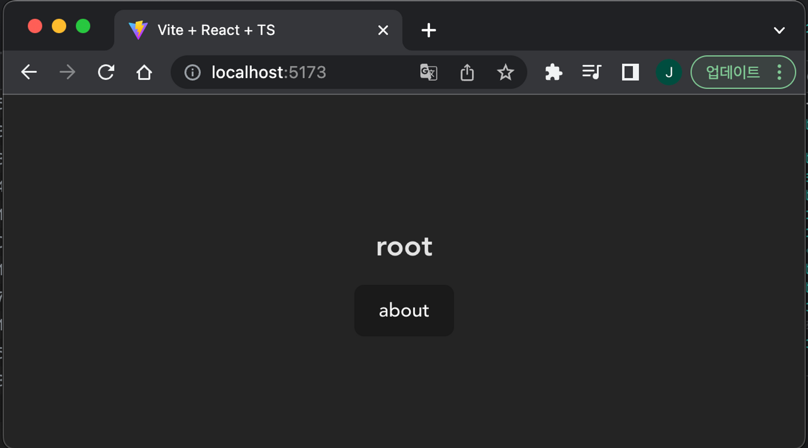
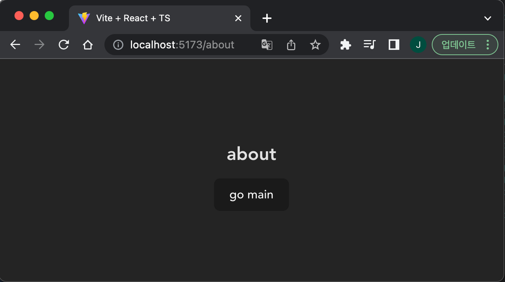

# React와 History API를 사용해 SPA Router 기능 구현하기

## 0. 시작에 앞서..

과제를 진행해보면서, 추가적으로 사용해보고 싶었던 것들을 좀 사용해봤습니다.
[pnpm](https://pnpm.io/), [Rome](https://rome.tools/) 이 2개 라이브러리 입니다.

### [pnpm](https://pnpm.io/)

npm, yarn과 같은 package manager 입니다. 때문에 clone해 사용한다면 스크립트 사용 시 아래와 같이 진행해주세요.

```sh
# dev
> pnpm dev

# build
> pnpm build

# preview
> pnpm preview
```

### [Rome](https://rome.tools/)

prettier와 같은 formatting 기능, eslint와 같은 linter 기능을 모아서 제공해주는 라이브러리 입니다.

특별히 세팅하실 건 없고, vscode extension recommendation 세팅이 되어 있어, clone 후 vscode로 열 경우 추천되는 확장 프로그램을 설치해주시면 됩니다.

## 1. 요구사항

1. 해당 주소로 진입했을 때 아래 주소에 맞는 페이지가 렌더링 되어야 한다.
   - `/` -> `root` 페이지
   - `/about` -> `about` 페이지
2. 버튼을 클릭하면 해당 페이지로, 뒤로 가기 버튼을 눌렀을 때 이전 페이지로 이동해야 한다.
   - 힌트) `window.onpopstate`, `window.location.pathname` History API(`pushState`)
3. Router, Route 컴포넌트를 구현해야 하며, 형태는 아래와 같아야 한다.
   ```tsx
   ReactDOM.createRoot(container).render(
     <Router>
       <Route path="/" component={<Root />} />
       <Route path="/about" component={<About />} />
     </Router>
   );
   ```
4. 최소한의 push 기능을 가진 useRouter Hook을 작성한다.
   ```tsx
   const { push } = useRouter();
   ```
5. 아래 스크린샷을 참고하여 앱을 작성한다.
   - TO-BE) Root 경로
     
   - TO-BE) About 경로
     

### 참고) Vite 초기 세팅

```sh
> yarn create vite
# 실행 후 cli의 지시에 따라 react, react-ts 중 택일하여 초기 세팅할 것
```

## 2. 구현 (src/lib/Router)

library를 구현한다는 관점에서, `lib` directory 하위에 `Router` 와 관련된 부분들을 모아 작성했습니다.

### Router.context.tsx

`Router` 핵심 로직들이 위치해 있습니다.

```tsx
const routerContext = createContext<RouterContext>(initialRouterContext);
```

를 통해 router state들을 관리할 `routerContext`를 하나 만들고, `useRouterContext` 훅, `RouterProvider` 컴포넌트를 만들어 이후 언급할 `Router`, `Route` 컴포넌트에서 사용할 수 있게끔 합니다.

```tsx
// useRouterContext hook
export const useRouterContext = () => {
  return useContext(routerContext);
};

// RouterProvider Component
// 아래에서 영역별로 설명드리도록 하겠습니다.
const getInitialHistory = () => [window.location.pathname];

export const RouterProvider = ({ children }: { children: React.ReactNode }) => {
  const [currentIndex, setCurrentIndex] = React.useState(0);
  const [history, setHistory] = React.useState<string[]>(getInitialHistory());
  const historyRef = useRef<string[]>(getInitialHistory());
  const [routerMap, setRouterMap] = React.useState<
    Map<string, React.ReactNode>
  >(new Map());

  const originChangeStateRef = useRef<{
    pushState: typeof window.history.pushState;
    replaceState: typeof window.history.replaceState;
  }>({
    pushState: window.history.pushState,
    replaceState: window.history.replaceState,
  });

  const setChangeProxy = useCallback(() => {
    CHANGE_STATE.forEach((changeState) => {
      window.history[changeState] = new Proxy(
        originChangeStateRef.current[changeState],
        {
          apply: (
            target,
            thisArg,
            [state, unused, path]: [
              Record<string, unknown>,
              string,
              string | URL | null | undefined
            ]
          ) => {
            let customState: HistoryState = { ...state, currentIndex };
            let nextIndex = currentIndex;

            if (changeState === "pushState") {
              nextIndex += 1;
              customState = { ...customState, currentIndex: nextIndex };

              // history stack에 이미 nextIndex가 있다면 대체한다.
              if (historyRef.current[nextIndex]) {
                historyRef.current = [
                  ...historyRef.current.slice(0, nextIndex),
                  path as string,
                ];
                setHistory(historyRef.current);
              } else {
                historyRef.current = [...historyRef.current, path as string];
                setHistory(historyRef.current);
              }

              setCurrentIndex((prev) => prev + 1);
            } else {
              customState = { ...customState, currentIndex: nextIndex };

              historyRef.current[currentIndex] = path as string;
              setHistory((prev) => {
                const next = [...prev];
                next[currentIndex] = path as string;
                return next;
              });
            }

            return target.apply(thisArg, [customState, unused, path]);
          },
        }
      );
    });
  }, [currentIndex]);

  const pushToMap = useCallback<RouterContextDispatcher["pushToMap"]>(
    (path, component) => {
      setRouterMap((prev) => {
        const newMap = new Map(prev);
        newMap.set(path, component);
        return newMap;
      });
    },
    []
  );

  const push = useCallback<RouterContextDispatcher["push"]>((path, state) => {
    window.history.pushState(state, "", path);
  }, []);

  const replace = useCallback<RouterContextDispatcher["replace"]>(
    (path, state) => {
      window.history.replaceState(state, "", path);
    },
    []
  );

  const handlePopState = useCallback((e: PopStateEvent) => {
    const nextIndex = (e.state as HistoryState).currentIndex;

    setCurrentIndex(nextIndex);
  }, []);

  useEffect(() => {
    setChangeProxy();

    window.addEventListener("popstate", handlePopState);

    return () => {
      window.removeEventListener("popstate", handlePopState);
    };
  }, [setChangeProxy, handlePopState]);

  useEffect(() => {
    replace(window.location.pathname, { currentIndex: 0 });
  }, [replace]);

  return (
    <routerContext.Provider
      value={{ currentIndex, history, routerMap, pushToMap, push, replace }}
    >
      {children}
    </routerContext.Provider>
  );
};
```

#### RouterProvider

`RouterProvider` 에서는 총 3개의 상태를 관리합니다.

- `currentIndex` : 현재 위치해 있는 history array index를 나타냅니다.
- `history` : 이동한 path들을 관리하는 history array 입니다. `window.history` 를 생각하시면 됩니다.
- `routerMap` : `Route` 컴포넌트에서 등록한 `[path, component]` 쌍을 관리하는 Map 객체입니다.

#### setChangeProxy()

`setChangeProxy()` 함수는 `window.history.pushstate`, `window.history.replacestate` 를 호출하게 될 때, 실제 동작을 수행하기 전 `currentIndex`, `history` 를 push/replace에 맞게 세팅해주기 위한 세팅을 하는 함수입니다.

이를 위해 [Proxy](https://developer.mozilla.org/ko/docs/Web/JavaScript/Reference/Global_Objects/Proxy) 객체를 사용해서, `window.history.pushstate`, `window.history.replacestate`를 wrapping 해줍니다.

`window.history.pushstate`, `window.history.replacestate` 시 첫번재 인자로 state를 넣을 수 있는데, 이를 활용해 index를 관리하게 됩니다. 이는 `popstate` 시에도 활용됩니다.

#### push, replace

실제 `window.history` 에 이동할 path를 주입시키는 함수들입니다.

### Router.tsx

`Router.context.tsx` 에서 export된 `RouterProvider` 를 단순 mapping한 컴포넌트입니다.

```tsx
import { RouterProvider } from "./Router.context";

type RouterProps = {
  children: React.ReactNode;
};

export const Router: React.FC<RouterProps> = ({ children }) => {
  return <RouterProvider>{children}</RouterProvider>;
};
```

### Route.tsx

`Router.context.tsx` 에서 export된 `useRouterContext()`의 `routerMap`, `pushToMap` 을 사용합니다.

`pushToMap` 으로 `routerMap` 에 `[path, component]`를 넣어주고, `window.location.pathname`과 `path`, 해당 `path`에 해당하는 component와 prosp로 들어온 component가 같은 경우 `routerMap` 에서 현재 경로에 대한 컴포넌트를 렌더링합니다.

```tsx
import { useRouterContext } from "./Router.context";
import { useEffect } from "react";

type RouteProps = {
  path: string;
  component: React.ReactNode;
};

export const Route: React.FC<RouteProps> = ({ path, component }) => {
  const { routerMap, pushToMap } = useRouterContext();

  const canRender =
    path === window.location.pathname && routerMap.get(path) === component;

  useEffect(() => {
    pushToMap(path, component);
  }, [pushToMap, path, component]);

  return <>{canRender && routerMap.get(window.location.pathname)}</>;
};
```

### Router.hook.ts

실제 Page Component 등에서 사용하게 될 `useRouter` hook 입니다.
단순히 `useRouterContext` hook 중 필요한 부분들만 필터링 해 내려줍니다.

```tsx
import { useRouterContext } from "./Router.context";

export const useRouter = () => {
  const { currentIndex, history, push, replace } = useRouterContext();
  return { currentIndex, history, push, replace } as const;
};
```

## 3. 사용

아래와 같이 `<Router>` 내에 `<Route />` 를 세팅합니다.

```tsx
import "./App.css";
import { Page } from "./components/Page";
import { Route, Router } from "./lib/Router";
import { Suspense, lazy } from "react";

const RootPage = lazy(() => import("./page/Root.page"));
const AboutPage = lazy(() => import("./page/About.page"));

function App() {
  return (
    <Suspense>
      <Router>
        <Page>
          <Route path="/" component={<RootPage />} />
          <Route path="/about" component={<AboutPage />} />
        </Page>
      </Router>
    </Suspense>
  );
}

export default App;
```

이 때, `<Route>` 컴포넌트에 동일한 path를 넣게 되면, 마지막에 세팅한 컴포넌트로 그려집니다.

### Page Components (src/page/About.page.tsx, src/page/Root.page.tsx)

각 Page Component에서는 `useRouter()` 를 사용해 `push`, `replace` 함수를 사용합니다.

#### Root.page.tsx

```tsx
import { Layout } from "../components/Layout";
import { useRouter } from "../lib/Router";

const RootPage = () => {
  const { push, replace } = useRouter();

  const moveToAbout = () => {
    push("/about");
  };
  const replaceToAbout = () => {
    replace("/about");
  };

  return (
    <Layout>
      <div>Root page</div>
      <div style={{ display: "flex", gap: "10px" }}>
        <button type="button" onClick={moveToAbout}>
          Go to about page
        </button>
        <button type="button" onClick={replaceToAbout}>
          replace to about page
        </button>
      </div>
    </Layout>
  );
};

export default RootPage;
```

#### About.page.tsx

```tsx
import { Layout } from "../components/Layout";
import { useRouter } from "../lib/Router";

const AboutPage = () => {
  const { push } = useRouter();

  const moveToRoot = () => {
    push("/");
  };

  return (
    <Layout>
      <div>About page</div>
      <button type="button" onClick={moveToRoot}>
        Go to root page
      </button>
    </Layout>
  );
};

export default AboutPage;
```
